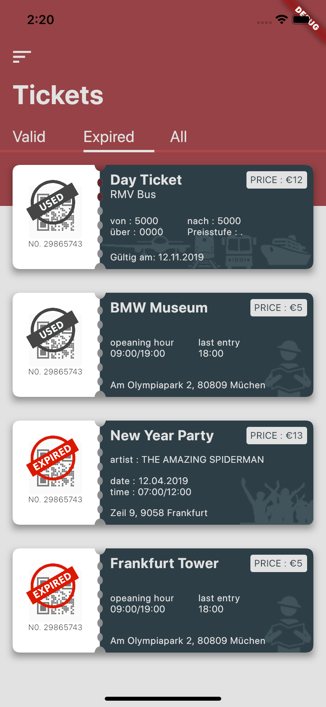

**Online e-ticket system in Flutter**

It is a simple application that has a list of tickets. It is just a dummy application for demonstrating Flutter.  It covers implementation of:

Scaffold widget

Drawer Navigation

CustomPainter Widgets for graphics

QR code

Simple animation

BLOC design pattern

Icons

Custom Widgets

Custom icons

**Packages used**

  - qr_flutter: 3.1.0
  - rxdart: 0.23.1

**UI Design**
<table>
  <tr>
    <td></td>
    <td></td>
    <td></td>
  </tr>
   <tr>
    <td></td>
    <td></td>
    <td></td>
  </tr>
   <tr>
    <td></td>
    <td></td>
    <td></td>
  </tr>
 </table>

